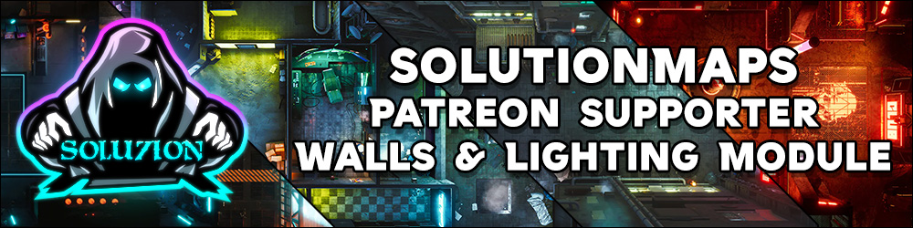

SolutionMaps - Patreon Supporter Cyberpunk & Sci-Fi Scene Module

https://www.patreon.com/solutionmaps

This module contains multiple compendiums of prebuilt scenes that include walls and lighting ONLY for Foundry VTT. 

--= SCENE IMAGES ARE NOT INCLUDED =--

Map images and/or videos can be acquired via my Patreon page located at https://www.patreon.com/solutionmaps

Blurred low-res images are provided to give you a visual cue of the map it corresponds to.

Installation:
Once the module has been installed and activated from within Foundry, you will find all the Scene Compendiums in your Compendiums tab. Right click on the Compendium you want to import, click "Import All" and you're done! 
Alternatively you can left-click to open each compendium and drag and drop the scene or group you want over to your Scenes Tab.

Enjoy!

-Solution

